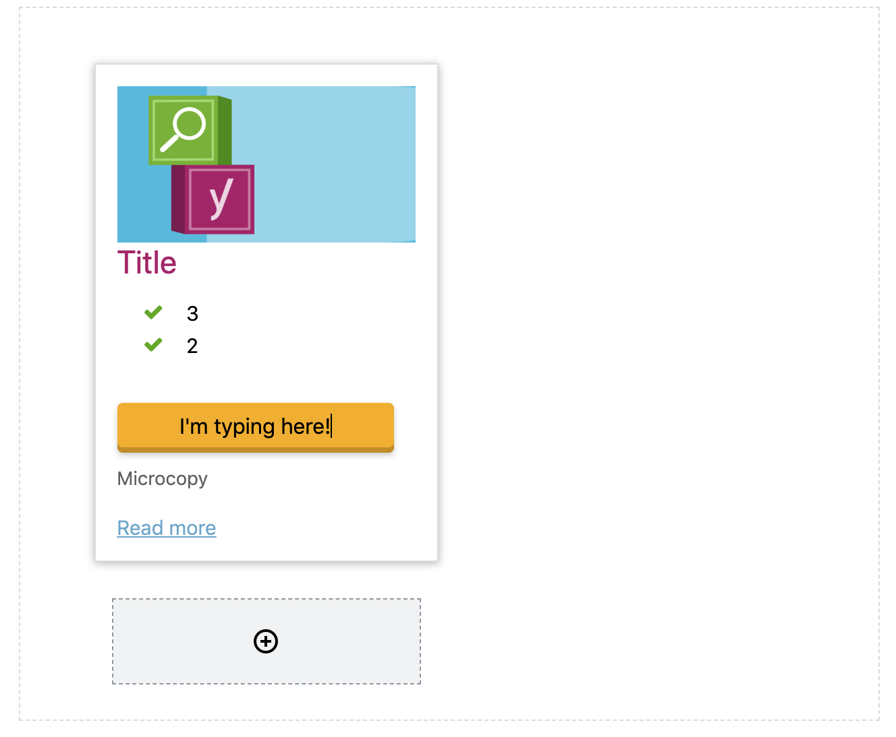

### Example
```php
add_action( 'guten-templates', function () {
	?>
	<script type="text/guten-template">
	{{block name="yoast/card" title="Card" category="common" }}
	<li class="card card--product">
	
	<header class="card__header">
		<a href="{{sidebar-input name="image-url" label="Image URL" }}">
			<div class="card__image">
				
			</div>
				
			{{rich-text name="title" tag="h2" class="card__title h3" }}
		</a>
	</header>

	<div class="card__content">
		{{rich-text name="usps" tag="ul" class="list--usp" multiline="li" }}
	</div>

	<footer class="card__footer mt-16">
		<div class="plugin-buy-button">
			<a href="{{sidebar-input name="cart-url" label="Cart URL" }}" class="buy-button button default" rel="nofollow">
				{{rich-text name="buy-button" tag="span" placeholder="Button" }}
			</a>
			{{rich-text name="microcopy" tag="span" placeholder="Microcopy" class="microcopy" }}
		</div>
		<a href="{{sidebar-input name="read-more-url" label="Read more URL" }}" class="read-more mt-16">
			{{rich-text name="read-more" tag="span" placeholder="Read more" }}
		</a>
	</footer>
	</li>
	</script>
	<script type="text/guten-template">
	{{block name="yoast/cards" title="Cards" category="common" }}
	<ul class="grid grid__col-{{sidebar-input name="columns" default="3" }}">
		{{inner-blocks allowed-blocks=[ "yoast/card" ] }}
	</ul>
	</script>
	<?php
} );
```
Turns into:
